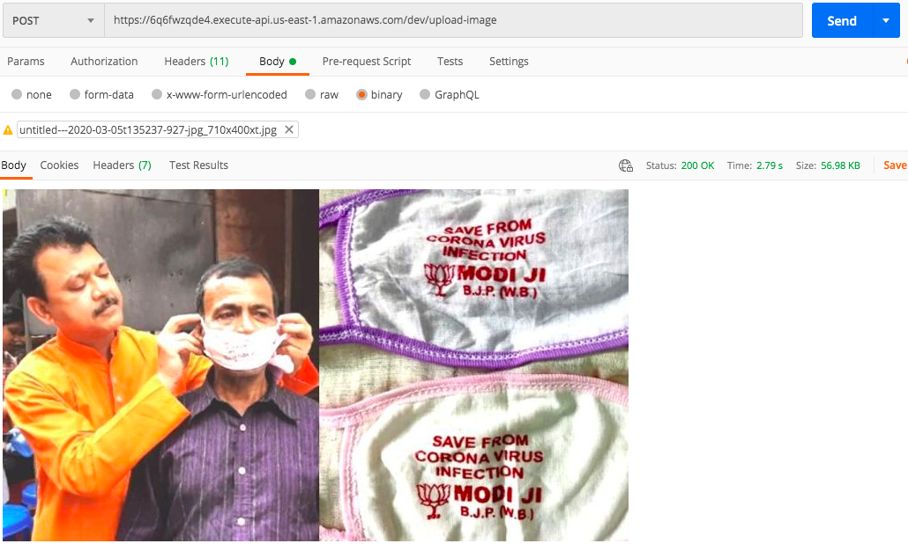

<h1 align="center">Face Mask Detection on AWS Lambda</h1>

## SKILLENZA HACKATHON

This application is used to detect if a person is wearing face mask or not. This demonstrates the use of aws serverless technologies like lambda.

<div align= "center">
  <h4>Face Mask Detection system built using OpenCV, Keras/TensorFlow using Deep Learning and Computer Vision concepts in order to detect face masks in static images. The application is hosted on AWS and primarily makes use of AWS Lambda service. Image Files are uploaded via AWS APIGateway which invokes a lambda function to upload images to bucket. From there another lambda picks up the image file, does processing on the image, to detect if person is wearing face mask or not and uploads the processed file on another folder in the bucket</h4>
</div>

## :hourglass: Project Demo
:movie_camera: [YouTube Demo Link]()

## :warning: Tech/framework used

- [OpenCV](https://opencv.org/)
- [Caffe-based face detector](https://caffe.berkeleyvision.org/)
- [Keras](https://keras.io/)
- [TensorFlow](https://www.tensorflow.org/)
- [MobileNetV2](https://arxiv.org/abs/1801.04381)
- [Python3.7.9](https://www.python.org/downloads/release/python-379/)
- [AWS Api Gateway]
- [AWS S3]
- [AWS Lambda]
- [AWS Linux 2]

## :star: Features


## :key: Prerequisites

All the dependencies and required libraries are included in the file <code>requirements.txt</code> [See here](https://github.com/harshgupta1/face-mask-detection-aws-serverless/blob/master/requirements.txt)

## 🚀&nbsp; Installation
1. Clone the repo
```
$ git clone https://github.com/harshgupta1/face-mask-detection-aws-serverless.git
```

2. Change your directory to the cloned repo and create a Python virtual environment named 'venviron' and execute all the commands as shown below to create a zip directory. This is needed as the size of the libraries are huge and AWS Lambda doesn't allows to upload any file whose size is greater that 250 MB. So we will package all the needed libraries in a zip file which will be used later on.
```
$ python3 -m venv venviron
$ source venviron/bin/activate
$ pip3 install -r requirements.txt
$ deactivate
$ cp -R face_detector venviron/lib/python3.7/site-packages/
$ cp mask_detector.model venviron/lib/python3.7/site-packages/
$ cd venviron/lib/python3.8/site-packages/
$ zip -r9 ~/face-mask-detection.zip ./
```

3. Now, run the following command in your Terminal/Command Prompt to install the libraries required
```
$ pip3 install -r requirements.txt
```

## :bulb: Training

1. Open terminal. Go into the cloned project directory folder and type the following command:
```
$ python3 train_mask_detector.py --dataset dataset
```
## Working

#### Image with Mask
<p align="center">
  
</p>
<p align="center">Upload image with mask</p>

<p align="center">
  
</p>
<p align="center">result</p>

#### Image without Mask
<p align="center">
  
</p>
<p align="center">Upload image without mask</p>

<p align="center">
  
</p>
<p align="center">result</p>

## :heart: Owner
Contributors
1. [Harsh Gupta](https://github.com/harshgupta1)
2. [Ashish Kanchan]
