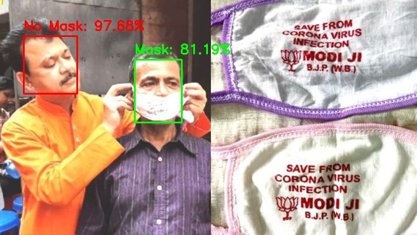

<h1 align="center">Face Mask Detection on AWS Lambda</h1>

## SKILLENZA HACKATHON

This application is used to detect if a person is wearing face mask or not. This demonstrates the use of aws serverless capabilities like lambda that can be used in applications where artificial intelligence is used to perform compute.

<div align= "left">
  <b><p>Face Mask Detection system built using Python, OpenCV, Keras/TensorFlow using Deep Learning and Computer Vision concepts in order to detect face masks in static images. The application is hosted on AWS and primarily makes use of AWS Lambda service. Image Files are uploaded via AWS APIGateway which invokes a lambda function to upload images to bucket. From there another lambda picks up the image file automatically as soon as the image is uploaded in bucket, then does processing on the image to detect, if the person is wearing face mask or not and uploads the processed file on another folder in the bucket.</p>
    <p>This also demonstrates that Lambda file size limits on deployed artifacts is no more a barrier and can be used to perform compute on-the-fly on multiple images in parallel.</p>
  </b>
</div>

## :hourglass: Project Demo
:movie_camera: [YouTube Demo Link](https://youtu.be/vgXsuO7LOYU)

## :warning: Tech/framework used

- [OpenCV](https://opencv.org/)
- [Caffe-based face detector](https://caffe.berkeleyvision.org/)
- [Keras](https://keras.io/)
- [TensorFlow](https://www.tensorflow.org/)
- [MobileNetV2](https://arxiv.org/abs/1801.04381)
- [Python 3.7.9](https://www.python.org/downloads/release/python-379/)
- [AWS Api Gateway] (https://docs.aws.amazon.com/apigateway/latest/developerguide/welcome.html)
- [AWS S3] (https://docs.aws.amazon.com/s3/)
- [AWS Lambda] (https://docs.aws.amazon.com/lambda/)
- [AWS EFS] (https://docs.aws.amazon.com/efs/)
- [AWS SDK] (https://docs.aws.amazon.com/pythonsdk/)

## :key: Prerequisites

All the dependencies and required libraries are included in the file <code>requirements.txt</code> [See here](https://github.com/harshgupta1/face-mask-detection-aws-serverless/blob/master/requirements.txt)

## 🚀&nbsp; Installation
1. Clone the repo
```
$ git clone https://github.com/harshgupta1/face-mask-detection-aws-serverless.git
```

2. Change your directory to the cloned repo and create a Python virtual environment named 'venviron' and execute all the commands as shown below to create a zip directory. This is needed as the size of the libraries are huge and AWS Lambda doesn't allows to upload any file whose size is greater that 250 MB. So we will package all the needed libraries in a zip file which will be used later on.
```
$ python3 -m venv venviron
$ source venviron/bin/activate
$ pip3 install -r requirements.txt
$ deactivate
$ cp -R face_detector venviron/lib/python3.7/site-packages/
$ cp mask_detector.model venviron/lib/python3.7/site-packages/
$ cd venviron/lib/python3.8/site-packages/
$ zip -r9 ~/face-mask-detection.zip ./
```

3. Create an EC2 instance and an Elastic File System and mount the ElasticFileSystem on the EC2 instance.

4. Upload and extract the face-mask-detection.zip under a shared mounted drive

5. Deploy the 'detect_mask_image_lambda.py' Lambda function on AWS and attach it to VPC and EFS. Configure environment variables. Also attach S3 as the Trigger for the lambda to execute.


6. Deploy the 'image_upload_lambda.py' lambda function on AWS and attach API Gateway as the Trigger for the lambda to execute.

7. Configure a new API on API Gateway and use it to Upload images 


## :bulb: Training

An initial training is required so that mask detector model can be created.
1. Open terminal. Go into the cloned project directory folder and type the following command:
```
$ python3 train_mask_detector.py --dataset dataset
```
## :star: Working
Image files are uploaded via POSTMAN and the returned output shows the image that is being uploaded.

#### Image with Mask and without Mask
<p align="center">
  
</p>
<p align="center">Upload image without mask</p>

<p align="center">
  
</p>
<p align="center">Result</p>

## :heart: Owners
Contributors
1. [Harsh Gupta](https://www.linkedin.com/in/harshg2003/)
2. [Ashish Kanchan](https://www.linkedin.com/in/ashish-kanchan-b4783462/)
